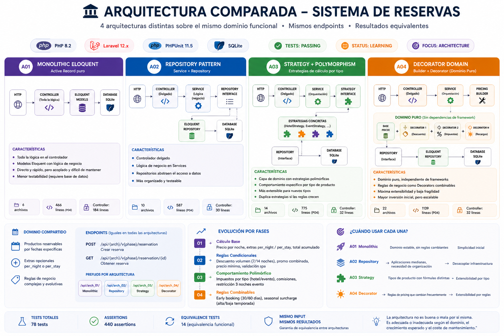
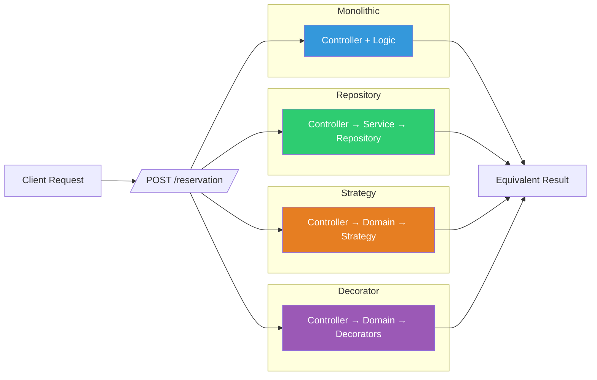
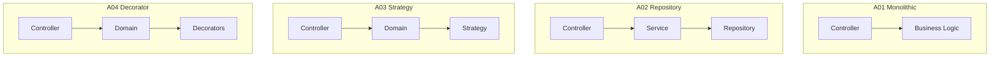
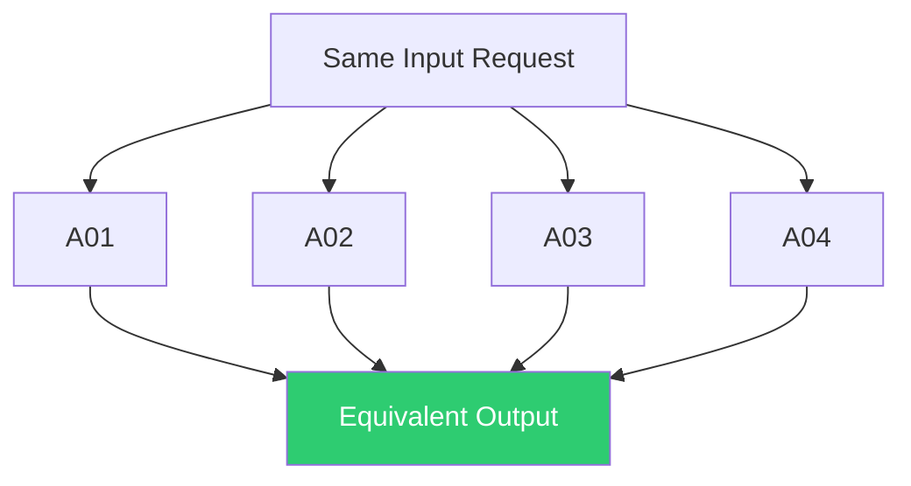

<p align="center">
  
</p>

<p align="center">
  <strong>4 arquitecturas · mismo dominio · mismas reglas · resultados equivalentes</strong>
</p>

<p align="center">
  <em>
    Comparativa práctica de cómo distintas arquitecturas escalan ante reglas de negocio crecientes
  </em>
</p>

---

<!-- Stack -->
<p align="center"><strong>🧱 Stack Tecnológico</strong></p>
<p align="center"><em>Tecnologías y herramientas que sustentan el proyecto</em></p>

<p align="center">
  <a href="https://www.php.net/" title="PHP 8.4">
    
  </a>
  <a href="https://laravel.com/docs" title="Laravel 13 Framework">
    
  </a>
  <a href="https://phpunit.de/documentation.html" title="PHPUnit Testing Framework">
    
  </a>
  <a href="https://www.sqlite.org/docs.html" title="SQLite Database">
    
  </a>
</p>


<!-- Arquitecturas -->
<p align="center"><strong>🏗 Arquitecturas</strong></p>
<p align="center"><em>Distintas implementaciones de la misma lógica de negocio</em></p>

<p align="center">
  <a href="https://github.com/MMoza/reservations/tree/main/app/Architectures/A01_MonolithicEloquent" title="A01 - Monolithic">
    
  </a>
  <a href="https://github.com/MMoza/reservations/tree/main/app/Architectures/A02_RepositoryPattern" title="A02 - Repository">
    
  </a>
  <a href="https://github.com/MMoza/reservations/tree/main/app/Architectures/A03_StrategyPolymorphism" title="A03 - Strategy">
    
  </a>
  <a href="https://github.com/MMoza/reservations/tree/main/app/Architectures/A04_DecoratorDomain" title="A04 - Decorator">
    
  </a>
</p>

<!-- CI + Métricas -->
<p align="center"><strong>🧪 Calidad & Estado</strong></p>
<p align="center"><em>Validado mediante tests automatizados y CI</em></p>

<p align="center">
  <a href="https://github.com/MMoza/reservations/actions" title="CI Tests">
    
  </a>
  
  
</p>
<br>
<br>

---

## 🔄 Misma request, distintas arquitecturas



---

## 📑 Tabla de Contenidos

- [Clonar y Ejecutar](#-clonar-y-ejecutar)
- [Estructura del Código](#-estructura-del-código)
- [Dominio](#-dominio)
- [Arquitecturas](#-arquitecturas)
- [Fases de Evolución](#-fases-de-evolución)
- [Resultados Finales](#-resultados-finales)
- [Documentación Completa](#-documentación-completa)
- [Suite de Tests](#-suite-de-tests)
- [Diagramas de Flujo](#-tabla-de-contenidos)

---

## 🚀 Clonar y Ejecutar

```bash
# Clonar el repositorio
git clone <repo-url>
cd reservations

# Instalar dependencias
composer install

# Configurar entorno
cp .env.example .env
php artisan key:generate

# Crear base de datos SQLite (por defecto)
touch database/database.sqlite

# Ejecutar migraciones y seeds
php artisan migrate --seed

# Ejecutar servidor de desarrollo
php artisan serve
```

---

<details>
<summary><strong>📂 Estructura del Código</strong></summary>

<br>

Las 4 arquitecturas viven dentro de `app/Architectures/`, cada una completamente aislada en su propio directorio. Cada fase es una evolución independiente que mantiene los mismos endpoints externos pero implementa la lógica internamente según su patrón arquitectónico.

### A01 – Monolithic Eloquent

Estructura plana: toda la lógica en controlador + modelos Eloquent.

```
app/Architectures/A01_MonolithicEloquent/
└── Phase_{01-04}/
    ├── Catalog/          # Catálogo de productos y extras
    ├── Controllers/      # Controlador con toda la lógica
    ├── Models/           # Modelos Eloquent
    └── Requests/         # Validación (Form Request)
```

### A02 – Repository Pattern

Añonde capa de servicio + repositorios para desacoplar infraestructura.

```
app/Architectures/A02_RepositoryPattern/
└── Phase_{01-04}/
    ├── Catalog/
    ├── Controllers/      # Controlador delgado
    ├── Models/           # Modelos Eloquent
    ├── Repositories/     # Contratos + implementaciones Eloquent
    │   ├── Contracts/
    │   └── Eloquent/
    ├── Requests/
    ├── Services/         # Lógica de negocio
    └── Exceptions/       # (Phase 02+) Excepciones de dominio
```

### A03 – Strategy + Polymorphism

Introduce capa de dominio con estrategias de cálculo polimórficas.

```
app/Architectures/A03_StrategyPolymorphism/
└── Phase_{01-04}/
    ├── Controllers/
    ├── Domain/           # Capa de dominio
    │   ├── Catalog/      # Catálogo de productos
    │   ├── Pricing/      # Estrategias de cálculo de precio
    │   └── Reservations/ # Modelos polimórficos por tipo
    ├── Models/           # Modelos Eloquent
    ├── Repositories/
    │   ├── Contracts/
    │   └── Eloquent/
    ├── Requests/
    ├── Services/         # Orquestación
    └── Exceptions/       # (Phase 02+) Excepciones de dominio
```

### A04 – Decorator Domain

Máxima separación: dominio puro con patrón Decorator para composición de reglas.

```
app/Architectures/A04_DecoratorDomain/
└── Phase_{01-04}/
    ├── Controllers/
    ├── Domain/           # Dominio puro (sin framework)
    │   ├── Catalog/
    │   ├── Pricing/      # Base + Decorators
    │   │   └── Decorators/  # Una clase por regla
    │   └── Reservations/
    ├── Models/           # Modelos Eloquent (persistencia)
    ├── Repositories/
    │   ├── Contracts/
    │   └── Eloquent/
    ├── Requests/
    ├── Services/         # Orquestación + Builder (Phase 04+)
    ├── Exceptions/       # (Phase 02+) Excepciones de dominio
    └── Catalog/          # (Phase 02+) Reglas de pricing
```

### Rutas

Cada arquitectura tiene su propio archivo de rutas:

```
routes/architectures/
├── arch_01_monolithic.php
├── arch_02_repository.php
├── arch_03_strategy.php
└── arch_04_decorator.php
```

</details>

---

<details>
<summary><strong>🧩 Dominio</strong></summary>

<br>

Sistema de reservas multi-producto con cálculo de precio progresivamente más complejo:

- **Productos reservables** por fechas específicas
- **Extras opcionales** — por noche (`per_night`) o fijos por estancia (`per_stay`)
- **Reglas de negocio** — descuentos por volumen, promociones combinadas, validaciones, impuestos, comisiones, early booking, recargos estacionales

### Endpoints

Cada arquitectura expone los mismos endpoints con prefijo único:

| Método | Endpoint | Descripción |
|--------|----------|-------------|
| `POST` | `/api/{arch}/v{phase}/reservation` | Crear reserva |
| `GET` | `/api/{arch}/v{phase}/reservation/{id}` | Obtener reserva |

| Prefijo | Arquitectura |
|---------|-------------|
| `/api/arch_01/` | Monolithic Eloquent |
| `/api/arch_02/` | Repository Pattern |
| `/api/arch_03/` | Strategy + Polymorphism |
| `/api/arch_04/` | Decorator Domain |

</details>

---

<details>
<summary><strong>🏗 Arquitecturas</strong></summary>

<br>

| | A01 Monolithic | A02 Repository | A03 Strategy | A04 Decorator |
|---|---|---|---|---|
| **Patrón** | Active Record puro | Service + Repository | Strategy Pattern | Builder + Decorator |
| **Archivos** | 6 | 10 | 14 | 22 |
| **Líneas (P04)** | 466 | 587 | 775 | 1139 |
| **Controlador** | 184 líneas | 30 líneas | 32 líneas | 32 líneas |
| **Filosofía** | Rápido y directo | Desacoplar infraestructura | Comportamiento por tipo | Composición dinámica |
| **Fortaleza** | Simplicidad inicial | Organización | Extensibilidad por tipo | Extensibilidad por reglas |
| **Debilidad** | Colapsa con complejidad | Complejidad inline | Duplica estrategias | Complejidad conceptual |

</details>

---

<details>
<summary><strong>📈 Fases de Evolución</strong></summary>

<br>

Cada fase introduce reglas de negocio más complejas sobre la misma base funcional.

| Fase | Tema | Reglas Introducidas |
|------|------|-------------------|
| [Phase 01](docs/phase-01-conclusiones.md) | Cálculo Base | Precio por noche, extras `per_night` / `per_stay`, total acumulado |
| [Phase 02](docs/phase-02-conclusiones.md) | Reglas Condicionales | Descuento volumen (7/14 noches), promo combinada, precio mínimo, validación spa |
| [Phase 03](docs/phase-03-conclusiones.md) | Comportamiento Polimórfico | Impuestos por tipo (hotel/evento), comisiones, restricción 3 noches evento |
| [Phase 04](docs/phase-04-conclusiones.md) | Reglas Combinables | Early booking (30/60 días), seasonal surcharge (alta/baja temporada) |

</details>

---

<details>
<summary><strong>📊 Resultados Finales</strong></summary>

<br>

### Ranking por criterio (Phase 04)

| Criterio | 🥇 Mejor | 🥈 Segundo | 🥉 Tercero | Peor |
|----------|----------|------------|------------|------|
| **Simplicidad** | A01 (6 archivos) | A02 (10) | A03 (14) | A04 (22) |
| **Controlador delgado** | A02/A03/A04 (30-32) | — | — | A01 (184) |
| **Servicio delgado** | A04 (99+152) | A03 (123) | A02 (172) | A01 (184) |
| **Testeabilidad** | A04 (dominio puro) | A03 (estrategia) | A02 (service) | A01 (requiere BD) |
| **Extensibilidad** | A04 (nuevo Decorator) | A03 (nueva Strategy) | A02 (modificar service) | A01 (modificar controller) |
| **Fragilidad** | A04 (baja) | A03 (media) | A02 (media-alta) | A01 (alta) |

### ¿Cuándo usar cada una?

| Escenario | Recomendación |
|-----------|--------------|
| Dominio estable, sin reglas cambiantes | **A01** o **A02** |
| Tipos de producto con fórmulas distintas | **A03** |
| Reglas de pricing que cambian frecuentemente | **A04** |

> La arquitectura no es buena o mala por sí misma. Es adecuada o inadecuada según la complejidad del dominio, la previsión de crecimiento y el coste de mantenimiento esperado.

</details>

---

<details>
<summary><strong>📚 Documentación Completa</strong></summary>

<br>

### Implementación por arquitectura

| | A01 Monolithic | A02 Repository | A03 Strategy | A04 Decorator |
|---|---|---|---|---|
| **Phase 01** | [doc](docs/phase-01/a01-monolithic.md) | [doc](docs/phase-01/a02-repository.md) | [doc](docs/phase-01/a03-strategy.md) | [doc](docs/phase-01/a04-decorator.md) |
| **Phase 02** | [doc](docs/phase-02/a01-monolithic.md) | [doc](docs/phase-02/a02-repository.md) | [doc](docs/phase-02/a03-strategy.md) | [doc](docs/phase-02/a04-decorator.md) |
| **Phase 03** | [doc](docs/phase-03/a01-monolithic.md) | [doc](docs/phase-03/a02-repository.md) | [doc](docs/phase-03/a03-strategy.md) | [doc](docs/phase-03/a04-decorator.md) |
| **Phase 04** | [doc](docs/phase-04/a01-monolithic.md) | [doc](docs/phase-04/a02-repository.md) | [doc](docs/phase-04/a03-strategy.md) | [doc](docs/phase-04/a04-decorator.md) |

### Conclusiones comparativas por fase

| Fase | Conclusiones | Equivalence Test |
|------|-------------|-----------------|
| **Phase 01** | [Conclusiones](docs/phase-01-conclusiones.md) | [test](tests/Feature/Phase01EquivalenceTest.php) |
| **Phase 02** | [Conclusiones](docs/phase-02-conclusiones.md) | [test](tests/Feature/Phase02EquivalenceTest.php) |
| **Phase 03** | [Conclusiones](docs/phase-03-conclusiones.md) | [test](tests/Feature/Phase03EquivalenceTest.php) |
| **Phase 04** | [Conclusiones](docs/phase-04-conclusiones.md) | [test](tests/Feature/Phase04EquivalenceTest.php) |

</details>

---

<details>
<summary><strong>🧪 Suite de Tests</strong></summary>

<br>

| Tipo | Tests | Assertions |
|------|-------|------------|
| Tests por arquitectura × fase | 64 | 306 |
| Equivalence tests (cross-architecture) | 14 | 134 |
| **Total** | **78** | **440** |

### Cobertura por fase

| Fase | A01 | A02 | A03 | A04 | Equivalence Test |
|------|-----|-----|-----|-----|-----------------|
| **Phase 01** | [test](tests/Feature/Arch01Phase01ReservationTest.php) | [test](tests/Feature/Arch02Phase01ReservationTest.php) | [test](tests/Feature/Arch03Phase01ReservationTest.php) | [test](tests/Feature/Arch04Phase01ReservationTest.php) | [Phase01EquivalenceTest](tests/Feature/Phase01EquivalenceTest.php) |
| **Phase 02** | [test](tests/Feature/Arch01Phase02ReservationTest.php) | [test](tests/Feature/Arch02Phase02ReservationTest.php) | [test](tests/Feature/Arch03Phase02ReservationTest.php) | [test](tests/Feature/Arch04Phase02ReservationTest.php) | [Phase02EquivalenceTest](tests/Feature/Phase02EquivalenceTest.php) |
| **Phase 03** | [test](tests/Feature/Arch01Phase03ReservationTest.php) | [test](tests/Feature/Arch02Phase03ReservationTest.php) | [test](tests/Feature/Arch03Phase03ReservationTest.php) | [test](tests/Feature/Arch04Phase03ReservationTest.php) | [Phase03EquivalenceTest](tests/Feature/Phase03EquivalenceTest.php) |
| **Phase 04** | [test](tests/Feature/Arch01Phase04ReservationTest.php) | [test](tests/Feature/Arch02Phase04ReservationTest.php) | [test](tests/Feature/Arch03Phase04ReservationTest.php) | [test](tests/Feature/Arch04Phase04ReservationTest.php) | [Phase04EquivalenceTest](tests/Feature/Phase04EquivalenceTest.php) |

Los **equivalence tests** verifican que las 4 arquitecturas producen resultados idénticos con el mismo input, garantizando equivalencia funcional absoluta.

</details>

---
<details>
<summary><strong>🔄 Diagramas de Flujo (ver más)</strong></summary>

## Evolución de complejidad


## Flujo interno



## Equivalencia funcional



</details>

---
## ▶️ Ejecutar Tests

```bash
php artisan test
```

---

> Este proyecto tiene fines educativos y de análisis arquitectónico. No es una implementación productiva, sino un entorno controlado para experimentar con diseño de software y evolución del dominio.